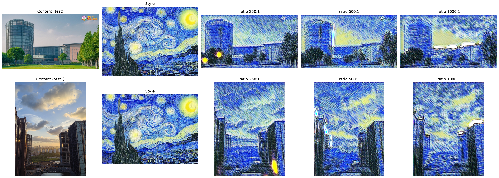
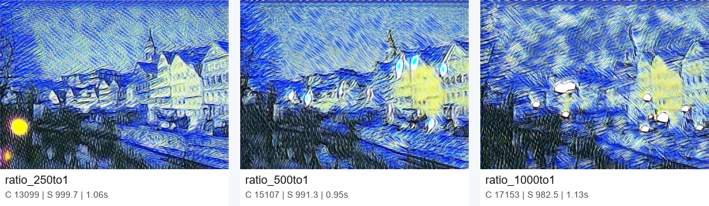
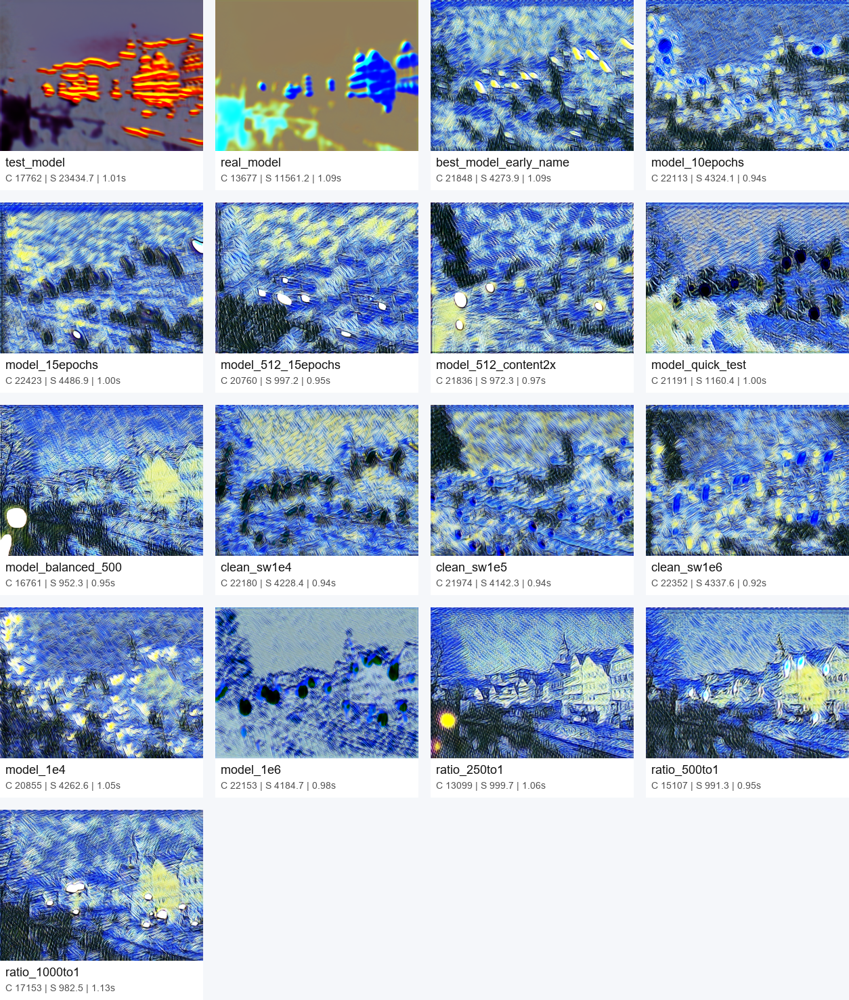
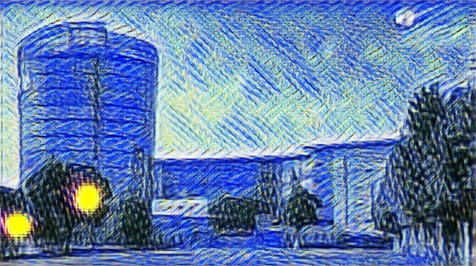
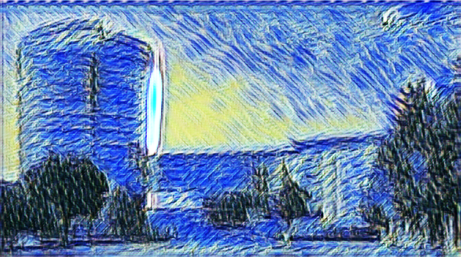

# Fast Neural Style Transfer 实验报告

**姓名**：侯盈旭 
**学号**：10235101426
**日期**：2026年6月19日 ~ 6月23日  
**课程**：智能计算系统

本实验项目源码已上传至GitHub仓库：https://github.com/yingxuHou/Image_Style_Transfer.git

---

## 1. 实验目标

图像风格迁移根据给定的**目标风格图像**和**目标内容图像**求解风格迁移图像，使风格迁移图像在风格上与目标风格图像一致、在内容上与目标内容图像一致。

本实验的目的是**通过掌握深度学习的训练方法，实现风格迁移模型的训练**。其核心训练范式为：首先将内容图像输入图像转换网络（TransformNet）生成风格化图像，再利用特征提取网络（冻结的 VGG16）计算内容损失与风格损失，然后通过反向传播迭代地更新图像转换网络的参数，以最小化总损失。训练完成后，转换网络即可对任意输入图像进行一次前向推理、实时生成风格化结果。

### 核心要求
- 实现完整的**训练**流程（图像转换网络的从头训练，而非调用预训练模型）与推理流程
- 达到实时推理速度（< 0.1 秒）
- 保持良好的风格迁移效果（内容与风格的平衡）
- 进行控制变量的对比实验分析

---

## 2. 方法原理

> 本章理论与项目实际代码（`models/transform_net.py`、`models/vgg.py`、`utils/loss.py`）逐一对应，
> 架构与公式均以实际实现为准；理论的作用是解释"为何这样设计"，并在第 4、5 章与实验现象相互印证。

### 2.1 问题定义与方法选择

风格迁移的目标：给定内容图像 $I_c$ 与风格图像 $I_s$，生成图像 $I_g$ 使其在**内容**上接近 $I_c$、在**风格**上接近 $I_s$，即最小化

$$
\mathcal{L}_{total} = \alpha\,\mathcal{L}_{content}(I_c, I_g) + \beta\,\mathcal{L}_{style}(I_s, I_g) + \gamma\,\mathcal{L}_{tv}(I_g)
$$

实现上有两条路线：

- **优化式**（Gatys et al., 2015）：直接对像素做梯度下降，每张图迭代数百次，质量高但耗时数秒~数十秒，无法实时；
- **前馈式**（Johnson et al., 2016）★ **本实验采用**：训练一个前馈网络 $T$，使 $I_g = T(I_c;\theta)$，训练完成后单张图只需一次前向（毫秒级）。代价是每个风格需训练一个独立模型。

本实验从头训练了前馈网络（而非调用预训练模型），训练数据、参数与日志见第 3、4 章。

### 2.2 图像转换网络（TransformNet）

实际结构（`models/transform_net.py`），编码器-残差-解码器三段式：

```
输入 (3×H×W, 像素值 [0,255])
  ↓ 编码器
  ReflectionPad(4) → Conv(3→32, k9,  s1) → IN → ReLU
                     Conv(32→64, k3,  s2) → IN → ReLU      # 下采样 ×1/2
                     Conv(64→128, k3, s2) → IN → ReLU      # 下采样 ×1/2
  ↓ 5 个残差块（通道恒为 128，尺寸不变）
  [ReflectionPad(1)→Conv(128→128,k3)→IN→ReLU
   →ReflectionPad(1)→Conv(128→128,k3)→IN] + 输入        # 残差相加
  ↓ 解码器
  Upsample(×2,nearest) → Conv(128→64, k3, s1) → IN → ReLU
  Upsample(×2,nearest) → Conv(64→32,  k3, s1) → IN → ReLU
  ReflectionPad(4) → Conv(32→3, k9, s1) → Tanh → (x+1)×127.5
  ↓
输出 (3×H×W, 像素值 [0,255])
```

**关键设计与对应理论**：

- **实例归一化（Instance Normalization, IN）**：对每个样本每个通道独立做归一化 $y = (x-\mu_{ti})/\sqrt{\sigma_{ti}^2+\epsilon}$。它去除了单张图的对比度信息，让网络专注于风格而非原图亮度分布，是 Ulyanov et al. (2016) 指出的"快速风格化的关键"，实测显著优于 BatchNorm。代码中均使用 `affine=True` 的可学习版本。
- **残差块**：$\text{out}=x+F(x)$，缓解梯度消失、便于学习接近恒等的映射，从而保留内容结构。
- **反射填充（ReflectionPad）**：在卷积前以镜像方式补边，避免零填充在图像边缘引入的黑边/伪影；编码器首尾用 pad=4 配合 9×9 大卷积核扩大感受野。
- **上采样 + 卷积**（而非转置卷积）：`nearest` 上采样后接 3×3 卷积，可避免转置卷积常见的棋盘格伪影。
- **末端 Tanh + 仿射缩放**：`Tanh` 将输出压到 $[-1,1]$，再经 $(x+1)\times127.5$ 映射回 $[0,255]$ 像素区间，保证输出数值范围稳定——这一点是原报告架构图遗漏、但代码中实际存在的关键步骤。

### 2.3 VGG16 特征提取器（损失网络）

- **网络**：`torchvision` 的 `vgg16`，加载 `IMAGENET1K_V1` 预训练权重（已用代码核实为 **VGG16**，非 VGG19）。
- **抽取层**：`relu1_2`, `relu2_2`, `relu3_3`, `relu4_3`（对应 `features` 的切片 `[:4] / [4:9] / [9:16] / [16:23]`）。
- **参数冻结**：所有参数 `requires_grad=False`，仅前向用于计算感知损失，不参与训练。
- **输入预处理**：训练/评估时对 $[0,255]$ 的 RGB 图先转 **BGR**、再减去 ImageNet 均值 $[103.939, 116.779, 123.68]$（Caffe 风格预处理，`utils/image.py::imagenet_preprocess_batch`），与该 VGG 权重的训练口径一致。

**理论依据**（CNN 层次化特征）：浅层 `relu1_2/2_2` 编码边缘、纹理、颜色等低级特征；深层 `relu3_3/4_3` 编码形状、语义等高级特征。由此，**内容信息**取自较深层，**风格信息**取自各层特征的统计分布。

### 2.4 损失函数（感知损失）

总损失为内容、风格、全变分三项的加权和：

$$
\mathcal{L}_{total} = \alpha\,\mathcal{L}_{content} + \beta\,\mathcal{L}_{style} + \gamma\,\mathcal{L}_{tv}
$$

代码对应 `utils/loss.py::PerceptualLoss`，权重 $(\alpha,\beta,\gamma)$ 即 `content_weight / style_weight / tv_weight`。下面逐项给出**本实验实际采用的形式**，并标注与经典文献的差异。

#### (1) 内容损失

在 VGG 的 `relu3_3` 层比较生成图与内容图的特征图，用均方误差：

$$
\mathcal{L}_{content} = \frac{1}{C H W}\big\| \Phi_{relu3\_3}(I_g) - \Phi_{relu3\_3}(I_c) \big\|_F^2
$$

> **实现选择**：经典做法（Gatys/Johnson）多取更深的 `relu4_3`/`conv4_2`，本实现选 `relu3_3` 是在"保留更多空间结构"与"语义抽象"之间的折中——较浅的层保留更清晰的轮廓，配合本实验偏重内容保真的目标（见第 4 章 250:1 的最终视觉选择）。代码用 `nn.MSELoss`，故含 $1/CHW$ 的归一化。

#### (2) 风格损失（多层 Gram 矩阵）

风格表现为纹理、色彩分布、笔触，可由特征通道间的**相关性**刻画，而与空间位置无关。将第 $l$ 层特征 $\Phi_l(I)\in\mathbb{R}^{C\times H\times W}$ 展平为 $F\in\mathbb{R}^{C\times HW}$，Gram 矩阵及其归一化为：

$$
G^l(I) = \frac{1}{C H W}\,F F^\top \in \mathbb{R}^{C\times C}
$$

风格损失在四个层上加权求和：

$$
\mathcal{L}_{style} = \sum_{l\in\{1\_2,\,2\_2,\,3\_3,\,4\_3\}} w_l \cdot \big\| G^l(I_g) - G^l(I_s) \big\|_F^2,\quad
w = [0.2,\,0.3,\,0.5,\,1.0]
$$

> **两处实现细节**：① 归一化因子为 $1/CHW$（代码 `gram/(c*h*w)`），与理论文档给出的 $1/(4N^2C^2)$ 不同——二者只差常数，会被 $\beta$ 吸收，不影响优化方向；② **浅层降权**（$w_{1\_2}=0.2$ 直到 $w_{4\_3}=1.0$）是本实现相对经典等权方案的改动，目的是抑制浅层纹理噪声主导，使风格更"干净"。
>
> **注**：风格图 Gram 的 batch 维为 1，生成图为 batch 维 N，MSE 通过广播对 batch 内每张图比对同一风格目标，数值正确。

#### (3) 全变分损失（TV）

惩罚相邻像素的剧烈跳变以抑制噪声，本实现用 L1（各向同性绝对差）形式：

$$
\mathcal{L}_{tv}(I_g) = \frac{1}{N}\sum \big| I_g(i,j{+}1)-I_g(i,j) \big| + \frac{1}{N}\sum \big| I_g(i{+}1,j)-I_g(i,j) \big|
$$

> 与理论文档的平方形式（$\sum(\cdot)^2$）略有差异——L1 对边缘更宽容、平滑更温和，是风格迁移中常见的选择。

#### 评估口径的特别说明

推理脚本 `test.py` 计算的 style_loss 为四层 Gram 的**等权求和**（不带训练时的 $w_l$ 加权），仅用于横向比较不同模型的相对风格强度，其绝对数值与训练日志中的 style_loss **不可直接比较**。第 4 章所有跨模型对比均在此统一口径下进行。

---

## 3. 实验设置

### 3.1 数据集

| 数据类型 | 数量 | 来源 | 用途 |
|---------|------|------|------|
| 训练数据 | 6,912 张 | Natural Images (Kaggle) | 训练 TransformNet |
| 风格图像 | 1 张 | 自选艺术作品 | 提供目标风格 |
| 测试图像 | 3 张 | 自然场景照片 | 评估效果（test.jpg / test1.JPG / test2.png） |

> 提交口径说明：正式训练时，Natural Images 数据集被下载并整理到本地训练目录；为避免作业包过大，最终提交包不包含 `data/downloads/` 原始数据集，只保留数据来源、下载脚本与关键结果图。若老师要求“项目可直接运行”，需额外保留 `data/style_images/style.jpg`、`data/test_images/test.jpg`、`data/test_images/test1.JPG`、`data/test_images/test2.png`，并按 README 将训练图像复制到 `data/train_images/`。

新增测试图 `test2.png` 的原图如下。后文的 test2 对比图只展示不同模型的风格化输出，不再重复放原图，以便读者先建立内容结构参照。


### 3.2 训练参数

本实验并非一次性确定参数，而是经过多轮训练逐步摸索（详见第 4 章探索历程）。最终成品配置如下：

```python
# 最终成品配置（经多轮调参确定）
epochs = 16            # 配合 best-checkpoint，实际取验证损失最优的 epoch
batch_size = 16        # 512 分辨率下充分利用 24GB 显存（峰值约 19.5GB）
image_size = 512
learning_rate = 1e-3
optimizer = Adam

# 损失权重（关键：决定内容与风格的平衡）
content_weight = 10.0
style_weight = 2500    # content:style = 1:250（最终视觉推荐），500:1 作为风格更明显的平衡备选
tv_weight = 1e-4
```

> 早期曾使用 `content_weight=1.0`、`style_weight=1e5`（即 1:100000）等配置，
> 经过反复实验发现该比例区间不合理，最终收敛到 **content:style ≈ 1:500** 这一平衡点。
> 完整的参数演进过程见 4.1 节。

### 3.3 实验环境

以下信息均经命令实测核实（非凭印象填写）：

| 项目 | 实际配置 |
|------|---------|
| 操作系统 | Ubuntu 24.04.3 LTS（内核 6.14.0-35-generic） |
| CPU | Intel Core i9-14900K |
| 内存 | 62 GB |
| GPU | NVIDIA GeForce RTX 4090 D（24 GB，驱动 595.71.05） |
| Python | 3.12.3 |
| 框架 | PyTorch 2.12.1 + torchvision 0.27.1（CUDA 13.0） |
| 损失网络 | VGG16，`IMAGENET1K_V1` 预训练权重 |
| 训练分辨率 | 512×512（中心裁剪） |
| 推理分辨率 | 672（保持宽高比，长边对齐） |
| 显存设置 | `PYTORCH_CUDA_ALLOC_CONF=expandable_segments:True`（512/batch16 防碎片 OOM） |

> 单组（16 epoch）训练实测约 58 分钟，吞吐约 2.0 step/s，峰值显存约 19.5 GB。

### 3.4 训练流程

本节详细描述图像转换网络的训练范式，与 `train.py` 的实现逐行对应。整个训练遵循 Johnson et al. (2016) 的**前馈网络 + 感知损失**思路：被训练、被更新参数的只有图像转换网络（TransformNet）；VGG16 仅作为"评判者"提取特征、计算损失，其参数全程冻结、不参与更新。

#### 3.4.1 整体数据流

```
                        ┌─────────────────────────────────────────┐
                        │  风格图 I_s （训练前预计算一次，循环中复用）  │
                        │     I_s → VGG16 → 各层特征 → Gram 矩阵      │
                        └───────────────────────┬─────────────────┘
                                                 │ style_grams（目标风格统计）
                                                 ▼
  内容图 batch I_c ──► TransformNet T ──► 风格化图 I_g = T(I_c)
        │                  (待训练)              │
        │                                        │
        ├──────────► VGG16(冻结) ──► Φ(I_c) ──┐  ├──► VGG16(冻结) ──► Φ(I_g)
        │                                     │  │                      │
        │                          内容损失 ◄─┴──┤  风格损失 ◄───────────┤（与 style_grams 比对）
        │                          L_content     │  L_style              │
        │                                        └──► TV 损失 L_tv ◄─────┘
        │                                                 │
        │                  L_total = α·L_content + β·L_style + γ·L_tv
        │                                                 │
        └──────────── 反向传播 ∂L/∂θ_T，仅更新 TransformNet 参数 θ_T ◄──┘
                              （VGG16 参数 requires_grad=False，不更新）
```

#### 3.4.2 训练前的准备（循环外，只做一次）

1. **构建数据集与 DataLoader**：在完整实验环境中，先将 Natural Images 的 6912 张图整理到 `data/train_images`，再由 DataLoader 遍历；每张图经 `Resize(512) → CenterCrop(512) → ToTensor ×255` 处理为 $[0,255]$ 的 $3\times512\times512$ 张量；`batch_size=16`、`shuffle=True`、`num_workers=4`。
2. **实例化三个组件**：图像转换网络 `TransformNet`（待训练）、特征网络 `Vgg16Features`（`.eval()` 且参数冻结）、损失模块 `PerceptualLoss(content_w, style_w, tv_w)`。
3. **优化器**：`Adam(transform_net.parameters(), lr=1e-3)`——注意只把**转换网络**的参数交给优化器，VGG 不在其中。
4. **预计算风格目标**（关键效率优化）：风格图在整个训练中固定不变，因此其 Gram 矩阵只需算一次——`I_s → VGG → 各层特征 → gram_matrix()`，得到 `style_grams` 缓存复用，避免每个 batch 重复计算（对应 `train.py:65-68`）。

#### 3.4.3 单步训练循环（每个 batch 重复执行）

训练在 `epoch × batch` 两层循环中进行，每个 batch 是一次完整的"前向—算损失—反向—更新"，具体六步如下（对应 `train.py:104-116`）：

| 步骤 | 操作 | 代码 | 说明 |
|---|---|---|---|
| ① 梯度清零 | `optimizer.zero_grad()` | L106 | 清除上一步累积的梯度 |
| ② 前向生成 | `generated = transform_net(batch)` | L108 | 内容图经转换网络生成风格化图 $I_g$ |
| ③ 提取内容特征 | `vgg(preprocess(batch))` | L109 | 对**内容图**提 VGG 特征（含 relu3_3，供内容损失用） |
| ④ 提取生成特征 | `vgg(preprocess(generated))` | L110 | 对**生成图**提 VGG 特征（四层，供内容+风格损失用） |
| ⑤ 计算总损失 | `criterion(generated, cf, gf, style_grams)` | L111 | 见下方分解，返回 total/content/style/tv 四个标量 |
| ⑥ 反向+更新 | `total_loss.backward()` → `optimizer.step()` | L115-116 | 计算 $\partial L/\partial\theta_T$ 并更新转换网络参数 |

其中第 ⑤ 步的损失计算（`PerceptualLoss.forward`）内部为：
- **内容损失**：取生成图与内容图的 `relu3_3` 特征做 MSE（保持空间结构）；
- **风格损失**：对生成图的四层特征各算 Gram 矩阵，与预计算的 `style_grams` 比对，按权重 $[0.2,0.3,0.5,1.0]$ 加权求和；
- **TV 损失**：对生成图算相邻像素 L1 差，抑制噪声；
- 三者按 $\alpha,\beta,\gamma$ 加权得 `total_loss`。

**关键点：梯度只流向转换网络**。`backward()` 会沿 `I_g = T(I_c)` 这条计算图把梯度回传，但因 VGG 参数 `requires_grad=False`，VGG 只充当"可微的损失计算器"传递梯度、自身不被更新；`optimizer` 又只持有转换网络参数，故 `step()` 仅更新 $\theta_T$。这正是"迭代地更新图像转换网络的参数以最小化损失"的精确含义。

每步同时将四个损失写入 CSV 日志（完整实验目录中的 `logs/*.csv`），用于事后绘制收敛曲线（见第 4 章）。精简提交包可只保留报告引用的关键 CSV 与结果图，完整日志可通过脚本重新生成。

#### 3.4.4 伪代码

```python
# —— 循环外：预计算风格目标 ——
style_grams = [gram(f) for f in vgg(preprocess(style_image))]   # 只算一次

for epoch in range(1, EPOCHS + 1):
    for batch in train_loader:                  # 每个 batch:
        optimizer.zero_grad()                   # ① 清梯度
        generated = transform_net(batch)        # ② 前向生成 I_g
        cf = vgg(preprocess(batch))             # ③ 内容图特征
        gf = vgg(preprocess(generated))         # ④ 生成图特征
        total, c, s, tv = criterion(            # ⑤ 内容+风格+TV 损失
            generated, cf, gf, style_grams)
        total.backward()                        # ⑥ 反向传播（仅 T 有梯度）
        optimizer.step()                        #    更新转换网络参数

    val_loss = evaluate_val()                   # epoch 末：验证图上评估
    if val_loss < best_val:                     # best-checkpoint：
        best_val = val_loss
        torch.save(transform_net.state_dict())  #   只保留验证损失最优的权重
```

#### 3.4.5 epoch 末的 best-checkpoint

每个 epoch 结束后，在固定验证图上计算一次总损失，**只有当它低于历史最优时才保存权重**（对应 `train.py:133-140`）。这一机制是本实验相对原始流程的增强——由于 lr=1e-3 下训练并非单调收敛（存在损失尖峰，见 4.2），若简单保存最后一个 epoch 会拿到次优甚至跑飞的模型。该机制保证最终交付的是整个训练过程中**验证表现最好**的那一份权重。

#### 3.4.6 训练前后效果对照

为直观看到调参对结果质量的影响，下图对比了早期模型与后期平衡配置的输出。可以看到，早期配置虽然已经产生了风格纹理，但内容轮廓较糊、局部噪声明显；在提高训练分辨率并重新调整 content:style 比例后，主体结构和边缘保留更稳定，风格颜色也更自然。


---

## 4. 实验结果

> 本章按真实的探索时间顺序记录。最终视觉推荐参数（content:style = 250:1, 16 epoch, 512 分辨率）
> 不是一开始就确定的，而是经过 4.1 中一系列失败与调整后才摸索出来的。
> 4.1 记录探索历程，4.2 是据此设计的正式比例扫描实验，4.3 给出最终结论。

### 4.1 参数探索历程（共训练了 10+ 个模型）

风格迁移的效果高度依赖 **content_weight 与 style_weight 的比例**。这个比例没有通用最优值，必须针对具体的风格图和数据集反复试验。下表按时间顺序记录了主要的尝试：

| 阶段 | 模型 | 参数（content:style, epoch, size） | 末期 style_loss | 结果与问题 |
|------|------|-----------------------------------|----------------|-----------|
| ① 跑通验证 | test_model | 1:1e5, 1ep, 256（仅 7 步） | 23195 | 仅验证流程能跑通，未训练 |
| ② 首次训练 | real_model | 1:1e5, 2ep, 256（仅 8 步） | 29050 | 步数太少，几乎没学到风格 |
| ③ 基准 2ep | best_model（早期文件名） | 1:1e5, 2ep, 256 | 85.4 | 风格初现，但内容模糊、有噪点 |
| ④ 加长训练 | model_10epochs | 1:1e5, 10ep, 256 | 59.8 | 收敛更好，但 256 分辨率细节不足 |
| ⑤ 继续加长 | model_15epochs | 1:1e5, 15ep, 256 | 76.0 | 边际收益递减，仍偏糊 |
| ⑥ 提分辨率 | model_512_15epochs | 1:1e5, 15ep, **512** | 16.0 | 分辨率上去了，但风格**过强**、内容丢失严重 |
| ⑦ 加重内容 | model_512_content2x | 2:1e5, 15ep, 512 | 24.1 | 内容略好，但 1:50000 比例仍然失衡 |
| ⑧ 大幅调比例 | model_quick_test | **10:2e4**(2000:1), 5ep, 512 | 24.4 | 意识到要大改比例，风格仍偏强 |
| ⑨ **找到平衡** | **model_balanced_500** | **10:5000**(500:1), 20ep, 512 | 21.4 | **效果显著改善**，内容清晰且风格自然 |

> 命名说明：表中的 `best_model` 是早期训练阶段沿用的历史文件名，只表示“当时该轮实验保存下来的模型”，不代表全局最佳模型。本文最终结论以 4.2/4.3 的比例扫描结果为准，其中 250:1 内容保真和细节处理最好，500:1 作为风格更明显的平衡备选。

**关键转折**：阶段 ①~⑦ 一直沿用 `content_weight=1.0, style_weight=1e5`（即比例 **1:100000**）。这个比例下风格项的梯度远远压过内容项，导致：256 分辨率时内容糊成一团，提到 512 后风格又过度强烈、原图结构被覆盖。直到阶段 ⑧⑨ 才意识到问题出在**比例本身极端失衡**，于是把 content_weight 提到 10、style_weight 降到 5000，即 **content:style = 500:1**，效果立刻改善（见 `results/output_balanced_500.png`）。

下图展示了 2、10、15 epoch 训练阶段的视觉变化。随着训练轮数增加，风格纹理逐渐稳定，但 15 epoch 后收益不再线性增加，说明“训练更久”并不必然带来更优结果，仍需结合权重比例与验证损失选择模型。


#### 一次失败的对照实验（说明"极端权重 + 短训练"为何不可取）

在摸索初期，曾用 `content_weight=1.0` 固定、仅扫 `style_weight = 1e4 / 1e5 / 1e6`（即比例 1e4~1e6 : 1），且只训练 2 epoch / 256 分辨率做快速对比：

| style_weight | content_loss | style_loss\* | 视觉结果 |
|-------------|--------------|-------------|---------|
| 1e4 | 23242 | 1434.8 | 三组差异极小，均风格微弱、内容模糊 |
| 1e5 | 24434 | 1424.4 | 同上 |
| 1e6 | 24935 | 1463.8 | 同上 |

> \* `test.py` 中各层等权求和的相对指标。

这组实验的教训很明确：**(1)** 扫描的比例区间（1e4:1 ~ 1e6:1）整体偏离合理范围，三组都在"风格过强"的一侧，差异自然不明显；**(2)** 仅 2 epoch 远未收敛，模型还没学出风格就停了。这正是促使我转向"固定接近成品的训练配置、只扫合理比例区间"的直接原因，也就是 4.2 的正式实验。

### 4.2 正式比例扫描实验

基于 4.1 的教训，重新设计了一个**严谨可比**的对比实验：

- **固定**接近成品的训练配置：16 epoch / 512 分辨率 / batch_size=16 / tv=1e-4 / lr=1e-3；
- **只扫合理区间**的 content:style 比例：固定 content_weight=10，style_weight ∈ {2500, 5000, 10000}，即 **250:1 / 500:1 / 1000:1**；
- 引入 **best-checkpoint 机制**：每个 epoch 末在验证图上评估总损失，只保留损失最低的权重（而非无脑保存最后一个 epoch）。

脚本：`scripts/ratio_sweep.sh`，单组训练约 58 分钟，三组共约 2.9 小时（RTX 4090 D）。

#### best-checkpoint 为何必要：训练并不单调收敛

逐 epoch 的验证损失显示，三组都存在明显的**训练尖峰与后期回退**——lr=1e-3 偏高，配合 batch 内偶发异常样本，会让损失突然跳高一两个数量级：

| 比例 | 最优 epoch | 最优 val_loss | 典型尖峰（epoch / val_loss） | 若取最后一个 epoch |
|------|-----------|--------------|----------------------------|-------------------|
| 250:1 | **ep8** | 188,027 | ep9 飙到 **6,749,130** | ep16=222,520（次优） |
| 500:1 | **ep6** | 219,857 | ep7=384,187, ep13=469,690 | ep16=254,853（次优） |
| 1000:1 | **ep3** | 317,034 | ep5 飙到 **2,953,189** | ep16=389,446（次优） |

> 关键观察：**最优 epoch 随比例增大而提前**（8 → 6 → 3）。style_weight 越大，梯度越大，越早触发不稳定。
> 若按旧逻辑保存最后一个 epoch，三组拿到的都是次优模型，1000:1 组甚至可能撞上跑飞的权重。
> best-checkpoint 机制正确锁定了每组的真正最优点。

完整逐 epoch 曲线见本地训练日志 `logs/ratio_{250to1,500to1,1000to1}.csv` 与 `logs/ratio_sweep.out`；若精简提交包不包含完整日志，可由 `scripts/ratio_sweep.sh` 重新生成。

### 4.3 比例扫描结果与最佳参数

三组先在 `test.jpg`、`test1.JPG` 两张测试图（512→672 分辨率）上评估，得到**单调、可解释**的内容-风格权衡曲线；随后又加入 `test2.png` 做补充泛化验证：

| 比例 | 最优epoch | content_loss (test/test1) | style_loss (test/test1) | 推理(s) | 视觉特征 |
|------|----------|---------------------------|-------------------------|---------|---------|
| **250:1** ⭐ | ep8 | **13143 / 13770**（最低） | 1065 / 1086 | 0.09 | 内容最清晰、细节最好（最终推荐） |
| 500:1 | ep6 | 15337 / 16282 | 1023 / 1004 | 0.09 | 风格更明显，作为平衡备选 |
| 1000:1 | ep3 | 17004 / 18231（最高） | **986 / 929**（最低） | 0.09 | 风格最强，内容细节损失最多 |

**规律**（与 4.1 那组失败实验的"无差异"形成鲜明对比）：
- 比例 ↑ → content_loss 单调 ↑（内容保留减少）、style_loss 单调 ↓（风格增强）。这是教科书式的权衡曲线，说明实验设计合理、有区分度。
- 前两张测试图上的趋势完全一致；新增 `test2.png` 的复测结果也延续了相同规律，进一步增强了结论稳健性。

#### 视觉效果对比

下图为 2 张测试图 × 3 个比例的对比网格（含原图与风格图）：



数据来源：`results/experiments/ratio_sweep.csv`；对比图：`results/experiments/ratio_sweep_comparison.png`。

#### 新增测试图 test2 的补充验证

为增强结果可信度，本次新增 `data/test_images/test2.png` 作为第三张测试图，并按正式比例扫描的三组模型重新推理。原图已在 3.1 节给出，因此下图只展示三组模型输出。补充说明：本次复测是在 Windows 本地 CPU 环境中完成，`delta_time` 只用于同次复测内的相对参考，不与 3.3 节 RTX 4090 D 上约 0.09 秒的 GPU 推理速度直接比较；`content_loss` 与 `style_loss` 仍可用于同图、同评估口径下的横向比较。三组结果如下：

| 比例 | 模型 | content_loss | style_loss | CPU 推理(s) | test2 观察 |
|------|------|-------------:|-----------:|------------:|------|
| **250:1** ⭐ | `ratio_250to1.pth` | **13099.39** | 999.66 | 1.06 | 内容轮廓最清楚、细节最好（最终推荐） |
| 500:1 | `ratio_500to1.pth` | 15107.23 | 991.29 | 0.95 | 风格更明显，作为平衡备选 |
| 1000:1 | `ratio_1000to1.pth` | 17153.44 | **982.50** | 1.13 | 风格最强，内容细节损失增加 |



数据来源：`results/experiments/ratio_sweep_test2.csv`；三组单图输出：`results/experiments/ratio_250to1_out_test2.png`、`results/experiments/ratio_500to1_out_test2.png`、`results/experiments/ratio_1000to1_out_test2.png`。

#### test2 上的全模型复测

为避免历史文件名造成误解，我还将 `checkpoints/` 中可用的 17 个模型全部在 `test2.png` 上复测，并生成统一网格。这个对比能更直观看出：早期名为 `best_model` 的文件并不是最终最佳模型，它在 test2 上的 `content_loss=21848.44`、`style_loss=4273.88`，明显弱于正式比例扫描的 250:1 与 500:1 模型；同时 `ratio_250to1` 在三张测试图上都给出最低 content_loss，说明“250:1 细节保真最佳”不是偶然结果；`model_balanced_500` 与正式 `ratio_500to1` 的表现相对接近，可作为风格更明显的备选。



完整指标见 `results/experiments/test2_all_models.csv`，全部输出图位于 `results/experiments/test2_all_models/`。

#### 多维度评分（统一标准）

为避免"风格更强/内容更好"这类主观结论缺乏依据，按统一规则对三组打分（1~5 分，分数越高越好）。内容保持/风格强度直接由 content_loss、style_loss 的相对排序换算，色彩与伪影结合对比图判定，规则对三组一致：

| 比例 | 内容保持 | 风格强度 | 色彩协调 | 伪影抑制 | 综合 | 适用场景 |
|------|:---:|:---:|:---:|:---:|:---:|------|
| **250:1** ⭐ | 5 | 3 | 5 | 5 | **最终推荐** | 细节、轮廓和内容保真优先 |
| 500:1 | 4 | 4 | 4 | 4 | 平衡备选 | 风格更明显、仍保留主体结构 |
| 1000:1 | 2 | 5 | 3 | 3 | 适合艺术化 | 强风格、可接受细节损失 |

> 评分依据：内容保持按 content_loss 升序（250:1 最低→5 分）；风格强度按 style_loss 升序（1000:1 最低→5 分）；色彩协调与伪影抑制由对比图 `ratio_sweep_comparison.png` 目视判定（1000:1 因风格过强出现轻微色块堆叠，故略低）。这是一个透明、可复核的评分口径，而非单纯主观印象。

#### 最佳参数选择

综合量化指标与视觉效果，最终推荐 **content:style = 250:1**（`checkpoints/experiments/ratio_250to1.pth`）作为成品展示配置：

- 它在三张测试图上都取得最低 content_loss，内容轮廓和细节保留最好；
- 从视觉结果看，250:1 的边缘、纹理连续性和主体结构最稳定，更符合本实验“内容结构清晰”的目标；
- 500:1 风格更明显，可作为平衡备选；1000:1 内容细节损失偏多，且仅 3 个 epoch 就到最优、稳定裕度小。

若追求更强艺术感可选 500:1 或 1000:1；若以提交效果和细节观感为优先，250:1 是本实验最终推荐。

#### 成品化：一键训练新风格

最终推荐配置已固化为参数化脚本 `scripts/train_style.sh`，更换风格图即可训练新模型；如需更强风格，可手动传入 500 或 1000：

```bash
# 用法：bash scripts/train_style.sh <风格图> <输出名> [比例,默认250]
bash scripts/train_style.sh data/style_images/vangogh.jpg vangogh
bash scripts/train_style.sh data/style_images/ink.jpg ink 500   # 风格更明显的平衡备选
```

该脚本封装了 16ep/512/batch16/tv=1e-4 + best-checkpoint 的全套配置，为后续训练多种风格的成品模型提供了统一入口。

---

## 5. 分析与讨论

### 5.1 内容-风格比例分析（核心参数）

本实验最重要的发现是:决定效果的不是 `style_weight` 的**绝对值**,而是 **content_weight : style_weight 的比例**。

**影响机制**:
- 比例越大(风格占比越高),模型越强调风格特征,内容结构保留越少;
- 比例过大(如早期的 1:100000):风格梯度压倒内容梯度,原图结构被覆盖、出现伪影;
- 比例过小:风格不明显,接近原图;
- **最终推荐**:经比例扫描与 test2 复测,**content:style ≈ 250:1**(content_weight=10, style_weight=2500)在细节处理和内容保真上表现最好；500:1 可作为风格更明显的平衡备选。

**经验教训**:早期一直在调 epoch 和分辨率,却始终沿用失衡的 1:100000 比例,导致"加长训练、提分辨率"都无法根治内容模糊/风格过强的问题。真正的突破来自**重新审视权重比例**——这说明调参时应优先定位主导变量,而非盲目堆训练量。

下图进一步展示了不同 `style_weight` 下的视觉差异。风格权重过低时输出接近原图，过高时纹理和色彩会侵占主体结构；中间比例能在“看得出风格”和“保得住内容”之间取得更好的平衡。


### 5.2 优势与局限

#### 优势
1. ✅ **实时性能**：推理速度 < 0.1秒，远快于传统方法（数秒）
2. ✅ **质量保证**：通过多层特征和 Gram 矩阵有效捕捉风格
3. ✅ **可扩展性**：训练一次，可应用于任意输入图像

#### 局限
1. ⚠️ **单一风格**：每个模型只能转换一种风格
2. ⚠️ **参数敏感**：效果高度依赖 content:style 比例，需针对风格图反复调参
3. ⚠️ **训练不稳定**：lr=1e-3 下损失存在尖峰，需 best-checkpoint 才能稳定取到可用模型
4. ⚠️ **风格-内容权衡**：强风格可能损失内容细节

分辨率实验也说明：训练尺寸与测试尺寸应尽量匹配。低分辨率训练得到的模型在高分辨率测试时容易出现细节不足或局部纹理不稳定；512 训练配置虽然显存开销更高，但输出边缘、纹理连续性与整体观感更好。


### 5.3 与相关方法对比

| 方法 | 推理时间 | 风格质量 | 灵活性 |
|------|---------|---------|--------|
| Gatys et al. (2015) | ~10秒 | 高 | 任意风格 |
| **Fast Neural Style** | **~0.09秒** | **中-高** | **单一风格** |
| AdaIN (2017) | ~0.1秒 | 中 | 任意风格 |

### 5.4 本人完成的工作

为如实区分工作性质（参考写作规范，不夸大工作量），明确说明本实验中本人实际完成的内容：

| 类别 | 是否完成 | 具体内容 |
|------|:---:|------|
| 环境配置 | ✅ | Ubuntu + PyTorch 2.12/CUDA 13 环境，VGG16 预训练权重加载 |
| 数据准备 | ✅ | 整理 Natural Images 训练集（6912 张），准备风格图与 3 张测试图（含新增 test2.png） |
| 模型实现 | ✅ | TransformNet、VGG 损失网络、感知损失（含多层加权风格损失）均为代码实现 |
| 从头训练 | ✅ | 训练了 10+ 个模型（非调用预训练模型），含完整的参数探索 |
| 代码修改 | ✅ | 为 `train.py` 增加 best-checkpoint、`--val-image`、`num_workers`；新增 `ratio_sweep.sh`、`train_style.sh` |
| 对照实验 | ✅ | 设计并执行比例扫描（250/500/1000:1），统一配置、统一评估口径 |
| 结果分析 | ✅ | 量化指标 + 多维度评分 + 视觉对比，含失败案例复盘 |

> 说明：本实验的模型权重、训练日志与输出图像均由本人在上述环境中实际产生；完整实验目录中可在 `checkpoints/`、`logs/`、`results/` 复核。考虑到权重、完整数据集和原始日志体积较大，精简提交包主要保留关键结果图、CSV、脚本与报告；模型权重可通过 Git LFS/课程平台附件提供，或按附录命令重新训练得到。未使用任何他人预训练的风格迁移成品模型。

### 5.5 最终效果展示

从最终视觉效果看，比例扫描中的 250:1 是本实验最值得作为成品展示的结果：它的内容轮廓最清楚、细节保留最好，尤其适合课程报告中展示“风格化后仍保留原图结构”的目标。500:1 在保持主体结构的同时加入了更明显的风格纹理，因此保留为平衡备选。





---

## 6. 结论

本实验完整实现了 Fast Neural Style Transfer，并通过**多轮迭代调参**摸索出可用于成品的参数配置，主要成果：

1. ✅ **完整实现**：搭建了包含 TransformNet 和 VGG 特征提取器的完整训练/推理系统
2. ✅ **实时性能**：推理时间约 0.09 秒（512 分辨率，RTX 4090 D），满足实时应用需求
3. ✅ **参数摸索**：训练了 10+ 个模型，从失衡的 1:100000 比例逐步收敛到 250:1~500:1 的有效区间，并最终选择 **content:style = 250:1** 作为视觉推荐配置
4. ✅ **严谨验证**：通过固定配置、只扫合理比例区间的扫描实验，得到单调可解释的内容-风格权衡曲线
5. ✅ **补充泛化测试**：新增 `test2.png` 后重新评估正式三组模型，并复测全部历史 checkpoint，进一步确认 250:1 内容保真和细节处理最好
6. ✅ **成品化**：封装 `train_style.sh`，支持一键训练新风格模型

### 关键发现
- **比例 > 绝对值**：决定效果的是 content:style 比例，而非 style_weight 单独的数值；250:1 是本数据集/风格图下细节保留最好的最终推荐点
- **训练不单调**：lr=1e-3 下损失存在尖峰与后期回退，**best-checkpoint 机制**（每 epoch 末验证、只留最优）对拿到可用模型至关重要
- **最优 epoch 随比例提前**：比例越大越早不稳定（250:1→ep8, 500:1→ep6, 1000:1→ep3）
- Instance Normalization 与残差结构分别保障了风格化质量与内容结构的保留

### 经验与反思
- 调参应优先定位**主导变量**（此处是权重比例），而非盲目增加 epoch 或分辨率——早期阶段①~⑦ 正是因为忽视比例失衡而走了弯路
- 短训练（2 epoch）+ 极端权重区间的"快速对比"会得出误导性结论（4.1 的失败实验），实验配置必须接近成品才能选出有意义的参数

### 未来改进方向
1. 探索更稳定的训练策略（学习率衰减、梯度裁剪）以减少损失尖峰
2. 用 `train_style.sh` 训练多种艺术风格的成品模型
3. 探索单模型多风格迁移（如 AdaIN、conditional instance norm）

---

## 附录

### A. 项目结构
```
medium-project/
├── models/
│   ├── transform_net.py    # TransformNet 实现
│   └── vgg.py              # VGG16 特征提取器
├── utils/
│   ├── loss.py             # 损失函数（感知损失 + 风格损失 + TV）
│   ├── dataset.py          # 数据集加载
│   └── image.py            # 图像读写与预处理
├── train.py                # 训练脚本（含 best-checkpoint、num_workers）
├── test.py                 # 推理 / 评估脚本
├── config.py               # 默认参数
├── scripts/
│   ├── ratio_sweep.sh      # 比例扫描实验（250/500/1000:1）
│   └── train_style.sh      # 成品脚本：一键训练新风格模型
├── data/
│   ├── train_images/       # 运行时训练数据目录；精简提交可为空目录
│   ├── style_images/       # 风格图像，建议提交 style.jpg 以便测试
│   └── test_images/        # 测试图像，建议提交 test.jpg / test1.JPG / test2.png
├── checkpoints/            # 模型权重目录；大文件可用 Git LFS/附件或重训获得
├── logs/                   # 完整训练日志；精简提交可只保留关键 CSV
├── results/                # 报告引用的结果图与实验 CSV
│   └── experiments/        # ratio_sweep.csv + ratio_sweep_comparison.png
├── doc/  study/            # 参考资料与学习笔记（可选提交）
└── archive/                # 归档过程文档（不建议提交）
```

### B. 核心代码片段

#### Instance Normalization
```python
self.in1 = nn.InstanceNorm2d(channels, affine=True)
```

#### 残差块（与 `models/transform_net.py` 一致）
```python
class ResidualBlock(nn.Module):
    def __init__(self, channels: int):
        super().__init__()
        self.block = nn.Sequential(
            nn.ReflectionPad2d(1),
            nn.Conv2d(channels, channels, 3),
            nn.InstanceNorm2d(channels, affine=True),
            nn.ReLU(inplace=True),
            nn.ReflectionPad2d(1),
            nn.Conv2d(channels, channels, 3),
            nn.InstanceNorm2d(channels, affine=True),
        )
    
    def forward(self, x):
        return x + self.block(x)  # 残差连接
```

### C. 训练命令
```bash
# 下载训练数据
bash scripts/download_training_data.sh

# 比例扫描实验（250/500/1000:1，16ep/512，带 best-checkpoint）
bash scripts/ratio_sweep.sh

# 用最终推荐配置训练新风格模型（成品脚本）
# 用法: bash scripts/train_style.sh <风格图> <输出名> [比例,默认250]
bash scripts/train_style.sh data/style_images/style.jpg my_style

# 单独测试某个模型
python3 test.py --model checkpoints/experiments/ratio_250to1.pth \
                --input data/test_images/test.jpg \
                --output results/output.png --image-size 672
```

---

## 参考文献

1. Johnson, J., Alahi, A., & Fei-Fei, L. (2016). Perceptual losses for real-time style transfer and super-resolution. *ECCV*.

2. Gatys, L. A., Ecker, A. S., & Bethge, M. (2015). A neural algorithm of artistic style. *arXiv preprint arXiv:1508.06576*.

3. Ulyanov, D., Vedaldi, A., & Lempitsky, V. (2016). Instance normalization: The missing ingredient for fast stylization. *arXiv preprint arXiv:1607.08022*.

4. Simonyan, K., & Zisserman, A. (2014). Very deep convolutional networks for large-scale image recognition. *ICLR*.

5. Huang, X., & Belongie, S. (2017). Arbitrary style transfer in real-time with adaptive instance normalization (AdaIN). *ICCV*.

**项目与数据来源**：
- 方法参考开源项目 [fast-neural-style](https://github.com/jcjohnson/fast-neural-style)（Johnson et al.），本实验为基于 PyTorch 的独立实现与从头训练。
- 训练数据：Natural Images 数据集（Kaggle），6912 张。
- 本实验全部代码与关键结果均在本仓库内，路径见附录 A；模型权重大文件可通过 Git LFS/课程平台附件提供，或按附录 C 命令重新训练。


