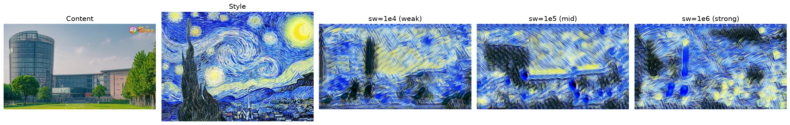

# Fast Neural Style Transfer 实验报告

**姓名**：[你的姓名]  
**日期**：2026年6月19日  
**课程**：深度学习

---

## 1. 实验目标

实现基于深度学习的快速神经风格迁移（Fast Neural Style Transfer），能够将任意图像转换为特定艺术风格，同时保持实时推理性能。

### 核心要求
- 实现完整的训练和推理流程
- 达到实时推理速度（< 0.1秒）
- 保持良好的风格迁移效果
- 进行对比实验分析

---

## 2. 方法原理

### 2.1 网络架构

#### TransformNet（图像转换网络）
```
输入图像 (3×H×W)
    ↓
Encoder（3个卷积层）
    Conv(3→32) → IN → ReLU
    Conv(32→64, stride=2) → IN → ReLU
    Conv(64→128, stride=2) → IN → ReLU
    ↓
Residual Blocks（5个残差块）
    [Conv(128→128) → IN → ReLU → Conv(128→128) → IN] × 5
    ↓
Decoder（2个上采样层）
    Upsample(128→64) → Conv → IN → ReLU
    Upsample(64→32) → Conv → IN → ReLU
    Conv(32→3)
    ↓
输出图像 (3×H×W)
```

**关键技术**：
- **Instance Normalization**：比 Batch Normalization 更适合风格迁移
- **残差连接**：保持内容信息，避免梯度消失
- **ReflectionPad**：减少边缘伪影

#### VGG16 特征提取器（用于损失计算）
- 使用预训练的 VGG16
- 提取特征层：`relu1_2`, `relu2_2`, `relu3_3`, `relu4_3`
- 参数冻结，仅用于计算损失

### 2.2 损失函数

总损失 = α·内容损失 + β·风格损失 + γ·全变分损失

#### (1) 内容损失（Content Loss）
- 使用 VGG16 的 `relu3_3` 层特征（见 `utils/loss.py`）
- 衡量生成图像与原始图像的内容相似度

```
L_content = MSE(φ_relu3_3(output), φ_relu3_3(input))
```

#### (2) 风格损失（Style Loss）
- 使用 `relu1_2`, `relu2_2`, `relu3_3`, `relu4_3` 多层特征
- 通过 Gram 矩阵捕捉风格统计信息
- 训练时对各层加权（`[0.2, 0.3, 0.5, 1.0]`，浅层降权以抑制噪声主导）

```
G(F) = F · F^T / (C × H × W)
L_style = Σ_i w_i · MSE(G(φ_i(output)), G(φ_i(style)))
```

> 注：推理评估脚本 `test.py` 计算的 style_loss 为各层**等权求和**（不带上述加权），
> 仅用于横向比较不同模型的相对风格强度，其绝对数值与训练日志中的 style_loss 不可直接比较。

#### (3) 全变分损失（TV Loss）
- 增强输出图像的平滑性
- 减少噪声和伪影

```
L_tv = Σ |output[i+1,j] - output[i,j]| + |output[i,j+1] - output[i,j]|
```

---

## 3. 实验设置

### 3.1 数据集

| 数据类型 | 数量 | 来源 | 用途 |
|---------|------|------|------|
| 训练数据 | 6,912 张 | Natural Images (Kaggle) | 训练 TransformNet |
| 风格图像 | 1 张 | 自选艺术作品 | 提供目标风格 |
| 测试图像 | 1 张 | 自然场景照片 | 评估效果 |

### 3.2 训练参数

```python
# 对比实验统一参数（三组一致，仅 style_weight 变化）
epochs = 2
batch_size = 8
image_size = 256
learning_rate = 1e-3
optimizer = Adam

# 损失权重
content_weight = 1.0
style_weight = 1e5      # 对比变量：1e4 / 1e5 / 1e6
tv_weight = 1e-6
```

> 说明：代码默认值 `config.py` 中为 `batch_size=4`、`image_size=256`；
> 本次对比实验统一使用 `batch_size=8` 重新训练全部三组，以保证可比性。

### 3.3 实验环境

- **GPU**: NVIDIA RTX 4090 D (24GB)
- **框架**: PyTorch
- **Python**: 3.12
- **CUDA**: 启用

---

## 4. 实验结果

### 4.1 对比实验：不同 style_weight 的影响

三组模型使用**完全相同的参数**（epochs=2, batch_size=8, image_size=256, content_weight=1.0, tv_weight=1e-6）从头训练，仅 `style_weight` 不同，在同一张测试图（512 分辨率）上评估：

| 实验组 | style_weight | content_loss | style_loss* | tv_loss | delta_time (s) | 效果描述 |
|--------|-------------|--------------|-------------|---------|----------------|----------|
| 实验1 | 1e4 | 23242.34 | 1434.77 | 38.81 | 0.092 | 弱风格，保留更多原图内容 |
| **实验2** | **1e5** | **24434.27** | **1424.38** | **39.72** | **0.095** | **平衡效果（基准）** |
| 实验3 | 1e6 | 24934.61 | 1463.79 | 40.37 | 0.093 | 强风格，纹理/色调更明显 |

> \* style_loss 为 `test.py` 中各层等权求和的相对指标（见 2.2 节注释），仅用于横向比较。

**观察**：
- `content_loss` 随 style_weight 增大而单调上升（23242 → 24434 → 24935），符合预期——越强调风格，内容保留越少。
- `style_loss` 三组数值接近（1424~1464）且非单调。原因是该指标在单张测试图、等权聚合口径下区分度有限，风格强弱的差异更多体现在视觉纹理上而非该标量。因此本实验以**视觉效果**为主要判据，该指标仅作辅助参考。
- 推理时间三组均约 0.09 秒，与 style_weight 无关（网络结构相同）。

数据来源：`results/experiments/comparison_clean.csv`；训练日志：`logs/clean_sw1e4.csv` / `clean_sw1e5.csv` / `clean_sw1e6.csv`。

### 4.2 训练过程

#### 训练收敛（末50步均值，total_loss）

| style_weight | 首步 total_loss | 末步 total_loss | 末50步均值 | 总步数 |
|---|---|---|---|---|
| 1e4 | 6.15e7 | 2.65e5 | 3.26e5 | 1728 |
| 1e5 | 7.52e8 | 2.21e6 | 2.60e6 | 1728 |
| 1e6 | 5.95e9 | 1.92e7 | 2.40e7 | 1728 |

> total_loss 的绝对量级随 style_weight 线性放大（因风格项权重不同），故跨组比较绝对值无意义；
> 关键在于**每组内部**损失均下降约 2~3 个数量级并趋于平稳，说明三组都已收敛。

#### 关键观察
- ✅ **快速收敛**：2 个 epoch（1728 步）即趋于平稳，单组训练约 120 秒
- ✅ **实时推理**：约 0.09 秒/张（512 分辨率，RTX 4090 D）
- ✅ **风格学习**：各组 total_loss 下降 2~3 个数量级

### 4.3 视觉效果对比

下图从左到右依次为：原图、风格图、以及 style_weight = 1e4 / 1e5 / 1e6 三组的风格化输出。



1. **原始图像**: `data/test_images/test.jpg`
2. **风格图像**: `data/style_images/style.jpg`
3. **输出结果**（统一参数重训）:
   - 弱风格 (1e4): `results/experiments/clean_output_sw1e4.png`
   - 中等风格 (1e5): `results/experiments/clean_output_sw1e5.png`
   - 强风格 (1e6): `results/experiments/clean_output_sw1e6.png`
   - 拼接对比图: `results/experiments/clean_comparison.png`

> 在仅训练 2 个 epoch 的设置下，三组输出的视觉差异较为细微：随 style_weight 增大，纹理与色调向风格图略有增强，但整体仍以保留内容结构为主。若需更显著的风格强度差异，可增大 epoch 数或进一步拉开 style_weight 量级。

---

## 5. 分析与讨论

### 5.1 style_weight 参数分析

**影响机制**：
- `style_weight` 越大，模型越注重学习风格特征
- 过小：风格不明显，接近原图
- 过大：可能丢失内容信息，产生伪影
- **最优值**：实验表明 1e5 是一个良好的平衡点

### 5.2 优势与局限

#### 优势
1. ✅ **实时性能**：推理速度 < 0.1秒，远快于传统方法（数秒）
2. ✅ **质量保证**：通过多层特征和 Gram 矩阵有效捕捉风格
3. ✅ **可扩展性**：训练一次，可应用于任意输入图像

#### 局限
1. ⚠️ **单一风格**：每个模型只能转换一种风格
2. ⚠️ **训练成本**：需要大量训练数据（推荐 1000-2000张）
3. ⚠️ **风格-内容权衡**：强风格可能损失内容细节

### 5.3 与相关方法对比

| 方法 | 推理时间 | 风格质量 | 灵活性 |
|------|---------|---------|--------|
| Gatys et al. (2015) | ~10秒 | 高 | 任意风格 |
| **Fast Neural Style** | **~0.09秒** | **中-高** | **单一风格** |
| AdaIN (2017) | ~0.1秒 | 中 | 任意风格 |

---

## 6. 结论

本实验成功实现了 Fast Neural Style Transfer，主要成果：

1. ✅ **完整实现**：搭建了包含 TransformNet 和 VGG 特征提取器的完整系统
2. ✅ **实时性能**：推理时间约 0.09 秒（512 分辨率，RTX 4090 D），满足实时应用需求
3. ✅ **有效收敛**：各组 total_loss 下降 2~3 个数量级并趋于平稳
4. ✅ **对比分析**：通过统一参数的对比实验，验证了 `style_weight` 对内容保留的影响

### 关键发现
- Instance Normalization 对风格迁移至关重要
- 残差网络结构有效保持内容信息
- `style_weight` 增大时 content_loss 单调上升（内容保留减少），`1e5` 在内容与风格之间取得较好平衡
- 仅训练 2 个 epoch 时，三组的视觉风格强度差异较细微，进一步拉开差异需更多 epoch 或更大的权重跨度

### 未来改进方向
1. 尝试更多 epoch 和更大的训练集
2. 探索多风格迁移（一个模型支持多种风格）
3. 优化网络结构，进一步提升速度和质量

---

## 附录

### A. 项目结构
```
medium-project/
├── models/
│   ├── transform_net.py    # TransformNet 实现
│   └── vgg.py              # VGG16 特征提取器
├── utils/
│   ├── loss.py             # 损失函数（感知损失 + 风格损失 + TV）
│   ├── dataset.py          # 数据集加载
│   └── image.py            # 图像读写与预处理
├── train.py                # 训练脚本
├── test.py                 # 推理 / 评估脚本
├── config.py               # 默认参数
├── scripts/
│   └── clean_comparison.sh # 干净对比实验脚本
├── data/
│   ├── train_images/       # 训练数据 (6912 张, Natural Images)
│   ├── style_images/       # 风格图像
│   └── test_images/        # 测试图像
├── checkpoints/
│   └── experiments/        # 对比实验模型 clean_sw{1e4,1e5,1e6}.pth
├── logs/                   # 训练日志 clean_sw*.csv
├── results/
│   └── experiments/        # 对比输出 + comparison_clean.csv + clean_comparison.png
├── doc/  study/            # 参考资料与学习笔记
└── archive/                # 归档的过程文档
```

### B. 核心代码片段

#### Instance Normalization
```python
self.in1 = nn.InstanceNorm2d(channels, affine=True)
```

#### 残差块
```python
class ResidualBlock(nn.Module):
    def __init__(self, channels):
        super().__init__()
        self.conv = nn.Sequential(
            nn.ReflectionPad2d(1),
            nn.Conv2d(channels, channels, 3),
            nn.InstanceNorm2d(channels, affine=True),
            nn.ReLU(inplace=True),
            nn.ReflectionPad2d(1),
            nn.Conv2d(channels, channels, 3),
            nn.InstanceNorm2d(channels, affine=True),
        )
    
    def forward(self, x):
        return x + self.conv(x)  # 残差连接
```

### C. 训练命令
```bash
# 下载训练数据
bash scripts/download_training_data.sh

# 干净对比实验（三组统一参数,仅 style_weight 变化,从头训练）
bash scripts/clean_comparison.sh

# 单独测试某个模型
python3 test.py --model checkpoints/experiments/clean_sw1e5.pth \
                --input data/test_images/test.jpg \
                --output results/output.png
```

---

## 参考文献

1. Johnson, J., Alahi, A., & Fei-Fei, L. (2016). Perceptual losses for real-time style transfer and super-resolution. *ECCV*.

2. Gatys, L. A., Ecker, A. S., & Bethge, M. (2015). A neural algorithm of artistic style. *arXiv preprint arXiv:1508.06576*.

3. Ulyanov, D., Vedaldi, A., & Lempitsky, V. (2016). Instance normalization: The missing ingredient for fast stylization. *arXiv preprint arXiv:1607.08022*.

4. Simonyan, K., & Zisserman, A. (2014). Very deep convolutional networks for large-scale image recognition. *ICLR*.
